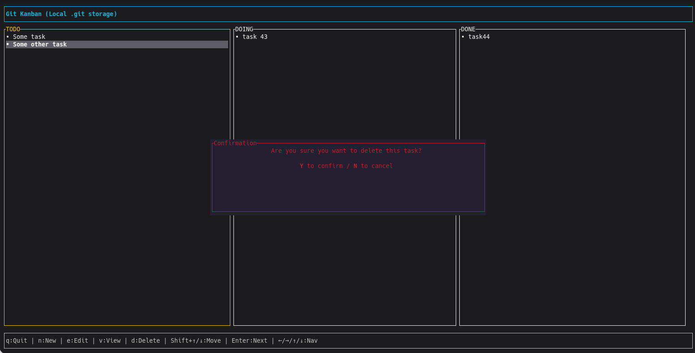

# git-kanban 🦀📋

A lightweight, terminal-based (TUI) Kanban board built with **Rust**. 

It is designed to keep your tasks private and local. It works seamlessly inside Git repositories (storing data in `.git/`).



## 🚀 Features

- **🔒 Local & Private**:
  - **Project Mode**: If run inside a git repo, tasks are saved in `.git/git-kanban.json` (not committed to history).
  - **Standalone Mode**: If run elsewhere, tasks are saved in `.kanban.json` (hidden file).
- **✏️ Full CRUD**: Create, Read, Update, and Delete tasks.
- **🛡️ Safety First**: Confirmation modal before deleting tasks.
- **↕️ Reordering**: Move tasks up and down within a column using `Shift + ↑/↓`.
- **👀 Details View**: View full text of long tasks in a popup modal.
- **⚡ Blazing Fast**: Written in Rust using `ratatui` and `crossterm`.

## 📦 Installation

### Prerequisites
- Rust and Cargo installed.

### Build and Install
Clone the repository and install the binary:

```bash
git clone https://github.com/hanejkopawel/git-kanban.git
cd git-kanban
cargo install --path . --force
```

## ⚙️ Setup as Git Alias (Optional)
To use it as a native git command:

```bash
git config --global alias.kanban '!git-kanban'
git kanban
```
